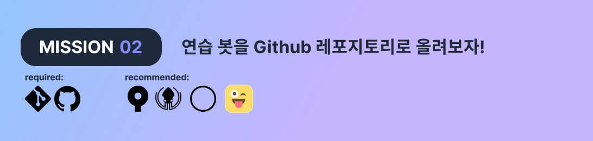
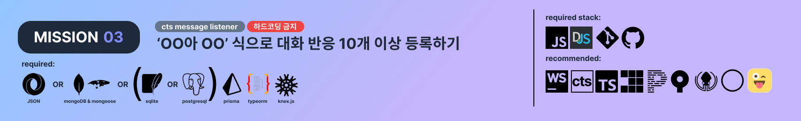
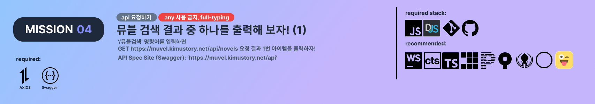
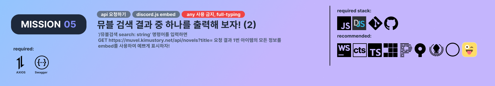
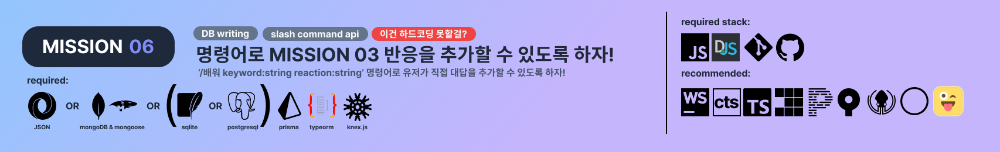
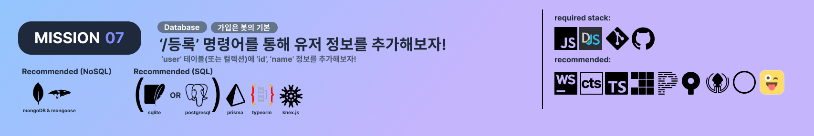
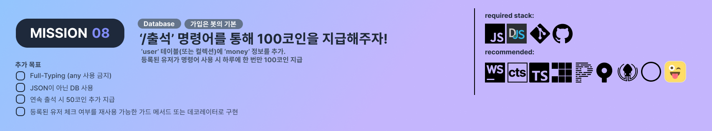

# kicochall
kimu coding challenge repo

## missions

finished: [src/kico_challenges/01-HelloCommand.ts](src/kico_challenges/01-HelloCommand.ts)

---

finished

---

finished: [src/kico_challenges/03-AskAndRespond.ts](src/kico_challenges/03-AskAndRespond.ts)

---

unfinished

---

unfinished

---

unfinished

---

unfinished

---

unfinished

---

unfinished
