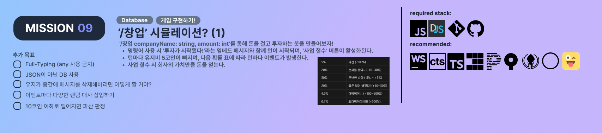

# kicochall
kimu coding challenge repo

## missions

done: [src\kico_challenges\01-HelloCommand.ts](src\kico_challenges\01-HelloCommand.ts)

---

not done

---

not done

---

not done

---

not done

---

not done

---

not done

---

not done

---

not done
